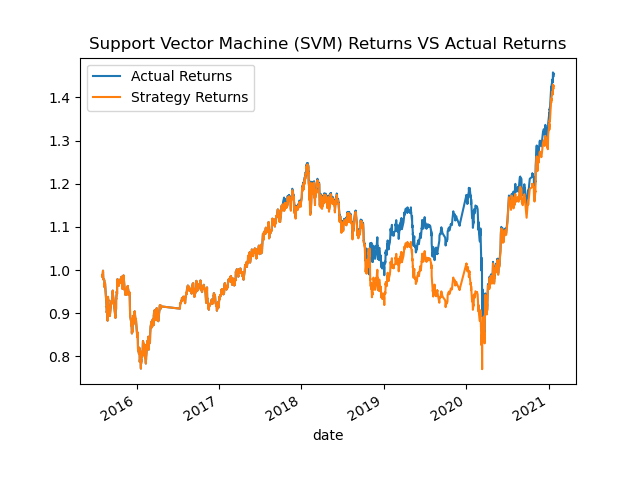
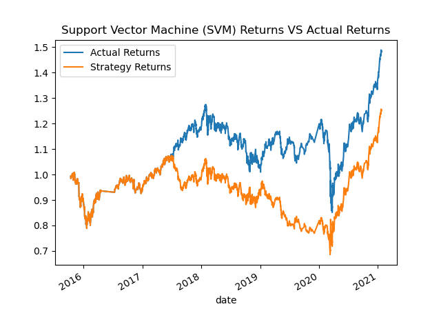
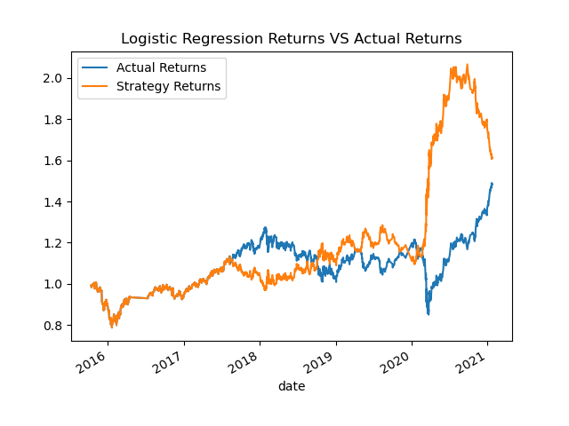
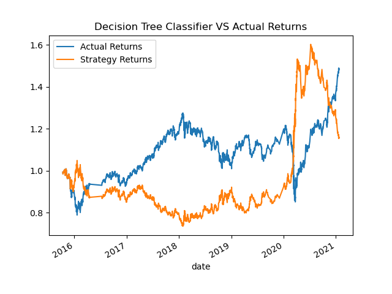
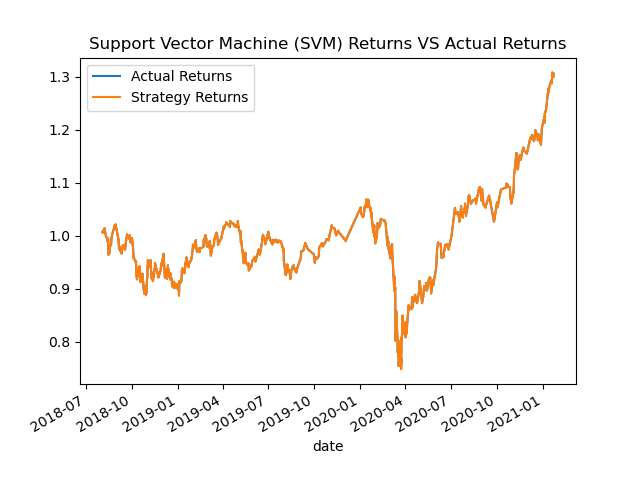
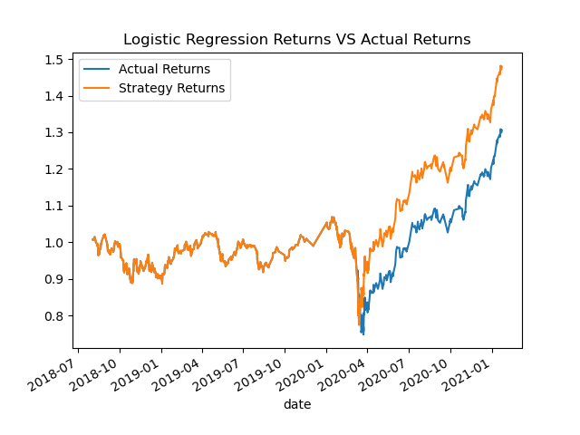
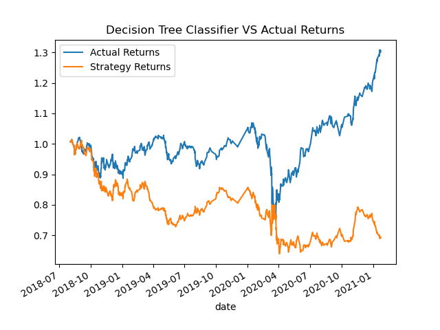
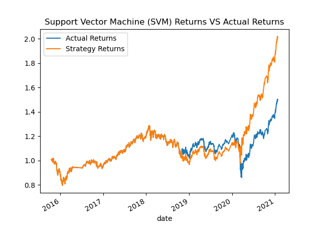
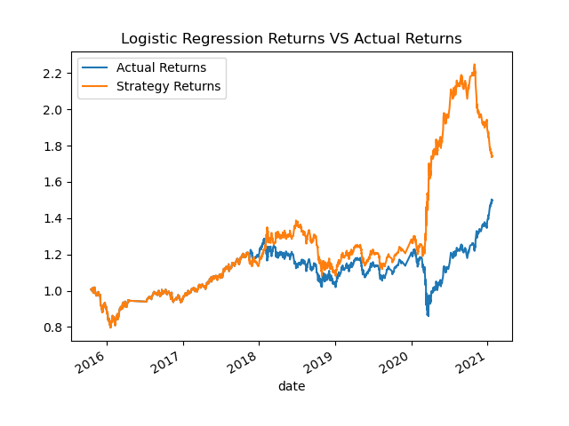
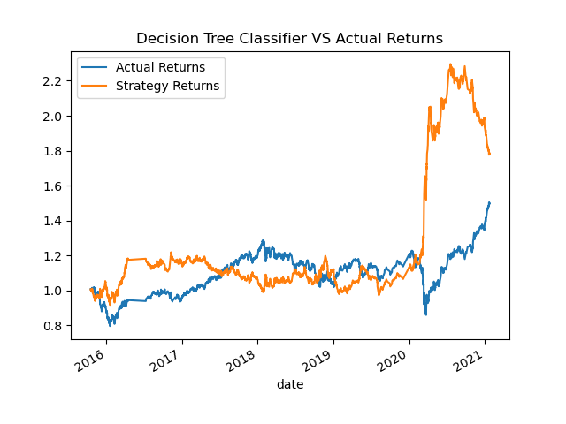

# 14_Algorithmic_Trading

## The Original Machine Learning Approach

## Training window increase Short_8 and Long_200
In the adjustment where only the short window was modified to 8 (2x increase) and the long window to 200 (2x increase), the Support Vector Machine(SVM) initially mirrored actual returns. However, a decline in performance was observed around one-third of the data. 

 Logistic Regression(LR) followed a similar trajectory to SVM in the initial stages but diverged as it moved inversely to actual returns. Notably, during the drop in actual returns in 2020, (LR) demonstrated an opposing upward move, only to reverse when actual returns began to ascend.
 

Decision Trees (DT) displayed a consistently negative correlation, suggesting that the optimal approach may involve taking the opposite of DT predictions for better results.

## Training size increase Month_40
Upon modifying the training size from 4 months to an extended period of 40 months (a 10x increase), the performance of different machine learning models varied. 
Specifically, the Support Vector Machine(SVM) exhibited performance akin to actual returns, suggesting that utilizing SVM might not be worthwhile given the associated risks.

Logistic Regression(LR) mirrored actual returns up to the midway point but slightly outpaced them in the second half.

 On the contrary, Decision Trees(DT) leads as a not viable strategy, showcasing poor performance compared to the others.
 

## Adjusting Training Size, Windows, and Waiting Periods
Increasing the training size to a period of 6 months while keeping the short window at 4 and expanding the long window to 150, along with extending the waiting period to 24 hours, has emerged as the most effective algorithmic trading strategy. Notably, across all three machine learning techniques—Support Vector Machines(SVM), Logistic Regression(LR), and Decision Trees(DT). This strategy outperformed when compared to actual returns and has proven to enhance the predictive power and effectiveness of the algorithmic trading models.

In the later stages, Support Vector Machines(SVM) showcased a remarkable acceleration, displaying no signs of slowing down.

Logistic Regression (LR) and Decision Trees (DT) initially somewhat mirrored the lateral movements to actual returns. However, in the later stages, both LR and DT exhibited a notable shift, executing aggressive moves in the opposite direction

